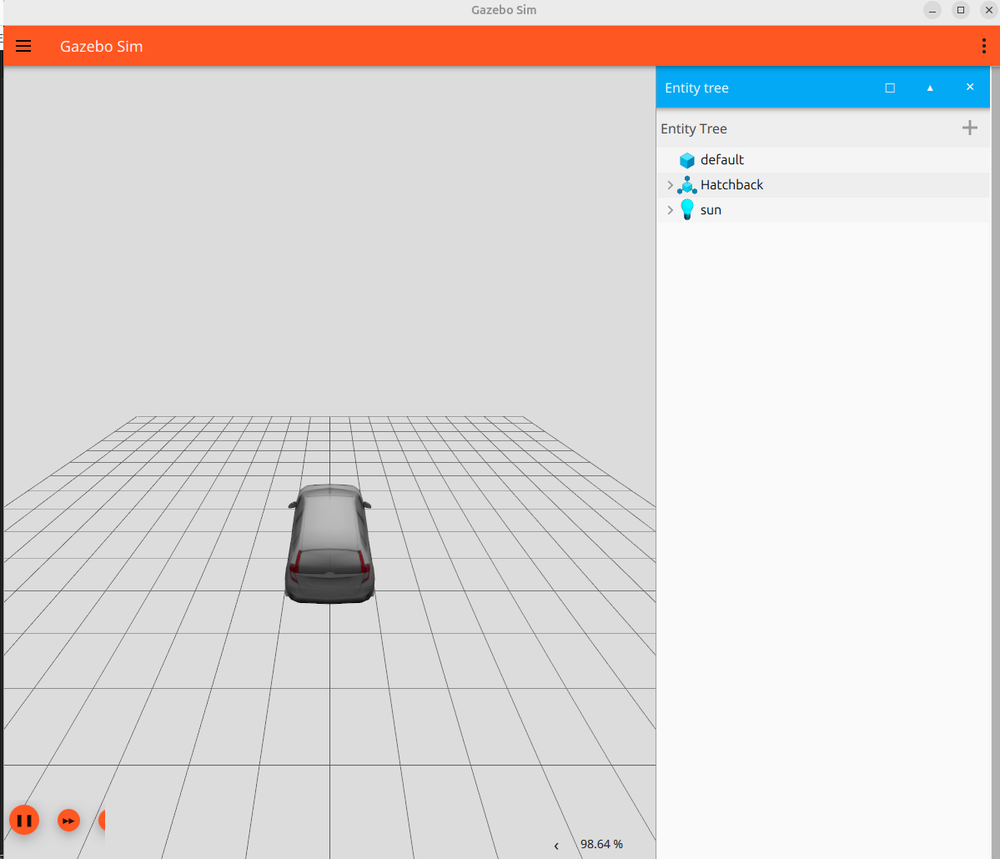

https://gazebosim.org/docs/all/sdf_worlds/   
The model : https://app.gazebosim.org/cyborg/fuel/models/Hatchback  
The Result is here :

  
In this tutorial :  
* Defining a world  
* Physics  
* Plugins
* GUI
--- World control plugin
--- World stats plugin
--- Entity tree
* Light
* Adding models
--- Spawning a model
--- Include the model URI
--- Download the model
